# Unix-FileSystem


## 目录

[TOC]

## 1. 课设要求

实现一个用户级文件系统。

- 以一个大文件作为虚拟磁盘，将其作为块设备进行读写；
- 通过format操作，将虚拟磁盘格式化成Ext2的文件卷格式；
- 实现系统调用
  creat
  open
  read
  write
  lseek（seek）
  close
  mkdir
  及其它
- 能够将文件写入虚拟磁盘，并可完好无损地取出

## 2. 完成情况

- [x] 将一个大文件作为虚拟磁盘，当作块设备使用
- [x] format该虚拟磁盘使之成为Ext2磁盘卷的结构
- [x] 使用磁盘缓存、superBlock缓存和inode缓存加快访问速度
- [x] 将外部文件写入虚拟磁盘，并完好取出
- [x] 使用仿linux的命令行对虚拟磁盘做文件操作

**实现的系统调用功能：**

- [x] creat
- [x] open
- [x] read
- [x] write
- [x] lseek（seek）
- [x] close
- [x] eof

**实现的用户命令功能：**

支持的用户指令有：

- [x] 【mount】
  功能：挂载磁盘

  用法：mount

  说明：任何一次程序执行，必须先执行mount!!!

- [x] 【unmount】
  功能：卸载磁盘

  用法：unmount

  说明：退出程序时可以手动执行，也可以由exit指令自动unmount

- [x] 【format】
  功能：格式化磁盘

  用法：format

  说明：一块虚拟磁盘disk.img使用前必须执行一次.（中途格式化可以将磁盘还原）

- [x] 【mkdir】

  功能：创建目录

  用法：mkdir dirname

  说明：目前仅支持在当前目录创建子目录，若有重名创建失败

- [x] 【touch】

  功能：创建新文件

  用法：touch filename

  说明：目前仅支持在当前目录创建新文件，若有重名创建失败

- [x] 【rm】

  功能：删除文件

  用法：rm filename

  说明：目前仅支持删除当前目录下的文件，注意要删除目录请使用rmdir

- [x] 【rmdir】

  功能：删除目录，递归删除该目录下的所有子目录、文件

  用法：rmdir dirname

  说明：删除文件请使用rmdir

- [x] 【help】

  功能：显示帮助信息

  用法：help

- [x] 【version】

  功能：显示作品信息

  用法：version

- [x] 【man】

  功能：显示命令使用说明（man暂未支持）

  用法：man

- [x] 【exit】

  功能：退出程序

  用法：exit

  说明：会自动卸载磁盘

- [x] 【ls】

  功能：显示目录下的所有文件

  用法：ls path

  说明：path必须是目录的路径，支持相对地址和绝对地址

- [x] 【cd】

  功能：改变当前工作目录

  用法：cd path

  说明：path必须是目录的路径，支持相对地址和绝对地址

- [x] 【clear】

  功能：清空命令行显示区

  用法：clear

- [x] 【store】

  功能：高级功能，将外部文件存入虚拟磁盘

  用法：store 外部文件路径 内部文件名

  说明：仅支持存放到当前目录下,外部文件大小不可超过虚拟磁盘大小

- [x] 【withdraw】

  功能：将虚拟磁盘中的文件提取到外部

  用法：store 内部文件名 外部文件路径

  说明：仅支持提取当前目录下的文件

## 3. 系统设计

### 3.1. 整体设计


用户空间包含一些应用程序（例如，文件系统的使用者）和 GNU C 库（glibc），它们为文件系统调用（打开、读取、写和关闭）提供用户接口。系统调用接口的作用就像是交换器，它将系统调用从用户空间发送到内核空间中的适当端点。

VFS 是底层文件系统的主要接口。这个组件导出一组接口，然后将它们抽象到各个文件系统，各个文件系统的行为可能差异很大。有两个针对文件系统对象的缓存（inode 和 dentry）。它们缓存最近使用过的文件系统对象。

每个文件系统实现（比如 ext2、JFS 等等）导出一组通用接口，供 VFS 使用。缓冲区缓存会缓存文件系统和相关块设备之间的请求。例如，对底层设备驱动程序的读写请求会通过缓冲区缓存来传递。这就允许在其中缓存请求，减少访问物理设备的次数，加快访问速度。以最近使用（LRU）列表的形式管理缓冲区缓存。注意，可以使用 sync 命令将缓冲区缓存中的请求发送到存储媒体（迫使所有未写的数据发送到设备驱动程序，进而发送到存储设备）。

这就是 VFS 和文件系统组件的高层情况。

Linux 以一组通用对象的角度看待所有文件系统。这些对象是超级块（superblock）、inode、dentry 和文件。超级块在每个文件系统的根上，超级块描述和维护文件系统的状态。文件系统中管理的每个对象（文件或目录）在 Linux 中表示为一个 inode。inode 包含管理文件系统中的对象所需的所有元数据（包括可以在对象上执行的操作）。另一组结构称为 dentry，它们用来实现名称和 inode 之间的映射，有一个目录缓存用来保存最近使用的 dentry。dentry 还维护目录和文件之间的关系，从而支持在文件系统中移动。最后，VFS 文件表示一个打开的文件（保存打开的文件的状态，比如写偏移量等等）。

### 3.2. 实现文件系统的大致步骤

文件系统主要负责管理磁盘上的空间，磁盘上至少要包含三部分数据： superblock，inodes和数据块。

(1)	首先得有一个创建文件系统的工具(如ext2文件系统的mke2fs)，用来将磁盘分区格式化成想要的格式，主要是初始化superblock和root inode。

(2)	写一个内核模块，在里面注册自己的文件系统，并且初始化mount函数

(3)	当用户在应用层调用mount命令时，VFS就会根据指定的文件系统类型找到我们写的内核模块，并且调用里面的mount函数

(4)	在mount函数里面读取磁盘上的superblock和root inode

(5)	初始化root inode的inode_operations和file_operations，然后返回给VFS

(6)	这样VFS就能根据root inode里提供的函数一级一级的往下找到path对应文件的inode

(7)	读取inode所指向的数据块（一个或者多个），根据文件的类型，解析数据块的内容。如果文件类型是普通文件，那么数据块里面就是文件的内容；如果文件类型是目录，那么数据块里面存储的就是目录下面所有子目录和文件的名称及它们对应的inode号；如果文件类型是软链接，那么数据块里面存储的就是链接到的文件路径。

总的来说，实现文件系统就是怎么在磁盘上组织文件，然后实现VFS所要求的superblock，inode以及inode_operations和file_operations。

## 4. 工程实现

### 4.1. 工程结构

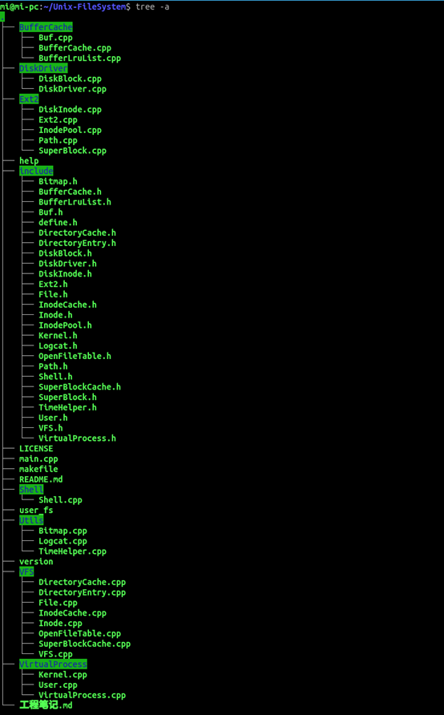

### 4.2. 关键数据结构

#### 4.2.1. Shell

```CPP
class Shell
{
  //处理用户输入，解析指令，调用相关的内核函数
private:
  char tty_buffer[TTY_BUFFER_SIZE];
  char split_cmd[MAX_PARAM_NUM][MAX_SINGLE_PARAM_LEN]{};
  int param_num = 0;
  char const *TAG;
  VFS *bounded_VFS;

public:
  Shell();
  ~Shell();
  int readUserInput();
  void parseCmd();
  INSTRUCT getInstType();
  char *getInstStr();
  char *getParam(int i);
  int getParamAmount();
  void setVFS(VFS *vfs);

  //shell调用的功能
  //显式调用
  void mount();   //挂载磁盘
  void unmount(); //卸载磁盘
  void format();
  void mkdir();
  void cat();
  void touch();
  void rm();
  void rmdir();
  void help();
  void version();
  void man();
  void mexit();
  void ls();
  void cd();
  void store();
  void withdraw();
  void clear();
};
```


#### 4.2.2. VFS

```CPP
class VFS
{
private:
  bool Mounted = false;
  Ext2 *p_ext2;                     //绑定的Ext2操纵模块。
  SuperBlockCache *superBlockCache; //VFS中的内存超级块，来自磁盘超级块在装载的时候刷入，卸载的时候刷回。
  InodeCache *inodeCache;           //VFS中内存Inode缓存
  DirectoryCache *directoryCache;   //与vfs绑定的目录项缓存
public:
  ~VFS();
  VFS();
  void mount();
  void unmount();
  int format();
  InodeId createFile(const char *fileName); //返回分配的Inode编号
  InodeId deleteFile(const char *fileName); //删除文件
  InodeId deleteDir(const char *dirName);
  InodeId deleteDirect(const char *fileName);
  int mkDir(const char *dirName); //返回分配的Inode编号
  int cd(const char *dirName);    //返回进入的dir的Inode
  void ls(const char *dirName);
  void ls(InodeId dirInodeID);
  int open(Path path, int mode);
  int close(int fd);
  int read(int fd, u_int8_t *content, int length);  //用户层面，文件必须先打开才可读
  int write(int fd, u_int8_t *content, int length); //用户层面，文件必须先打开才可写
  bool eof(FileFd fd);
  void registerExt2(Ext2 *ext2); //注册文件系统，载入SuperBlock
  void unregisterExt2();         //注销加载的文件系统，要刷回脏inode和superblock
  void bindSuperBlockCache(SuperBlockCache *superBlockCache);
  void bindInodeCache(InodeCache *inodeCache);
  void bindDirectoryInodeCache(DirectoryCache *directoryCache);
  bool isMounted();

};
```


#### 4.2.3. Ext2

```CPP
class Ext2
{
private:

  BufferCache *p_bufferCache; //绑定的BufferCache,ext2不直接和DiskDriver打交道，透过这个缓存层
  Ext2_Status ext2_status = Ext2_UNINITIALIZED;
public:
  void format(); //格式化
  int registerFs();
  int unregisterFs();
  Ext2_Status getExt2Status();
  int setBufferCache(BufferCache *p_bufferCache);
  int allocNewInode(); //分配一个新的inode
  DiskInode getDiskInodeByNum(int inodeID);
  void updateDiskInode(int inodeID, DiskInode diskInode);

  InodeId locateInode(Path &path);
  InodeId locateDir(Path &path);
  InodeId getInodeIdInDir(InodeId dirInodeId, FileName fileName);

  int bmap(int inodeNum, int logicBlockNum); //文件中的地址映射。查混合索引表，确定物理块号。
  //逻辑块号bn=u_offset/512
  void loadSuperBlock(SuperBlock &superBlock);
};
```


#### 4.2.4. DiskDriver

```CPP
class DiskDriver
{
private:
  bool isMounted = false;
  FileFd DiskFd; //挂载磁盘文件的句柄
  DiskBlock *DiskMemAddr;
  const char *TAG;

public:
  DiskDriver();
  ~DiskDriver();
  int mount();                                       //安装img磁盘
  void unmount();                                    //卸载磁盘
  DiskBlock *getBlk(int blockNum);                   //获得指向块的指针
  void readBlk(int blockNum, DiskBlock *dst);        //读取块
  void writeBlk(int blockNum, const DiskBlock &blk); //写入块
  bool isDiskMounted();
  DiskBlock *getDiskMemAddr();
};
```


#### 4.2.5. BufferCache

```CPP
class BufferCache
{
private:
  Buf bFreeList; //自由缓存队列控制块，将缓存控制块中b_addr指向相应缓冲区首地址。
  Buf m_Buf[BUFFER_CACHE_NUM];        //缓存控制块数组
  DiskBlock Buffer[BUFFER_CACHE_NUM]; //缓存块空间
  //BufferLruList bufferLruList;
  DiskDriver *diskDriver;

public:
  void initialize(); //缓存控制块的初始化。
  void setDiskDriver(DiskDriver *diskDriver);
  int mount();
  void unmount();        //unmount的时候需要把脏缓存刷回
  Buf *Bread(int blkno); //将物理盘块一整块读入diskBlockPool
  void Bwrite(Buf *bp);  //写一个磁盘块
  void Bdwrite(Buf *bp); //延迟写磁盘块
  void Bflush();         //将dev指定设备队列中延迟写的缓存全部输出到磁盘.可能是在卸载磁盘的时候，需要全部刷回
  //void writeBlk(int blkno, const DiskBlock &contentToWrite); //将内存的一块区域，写入缓冲区（如果不在缓冲区的话，需要先读）
  Buf *GetBlk(int blkno); /* 申请一块缓存，用于读写设备dev上的字符块blkno。*/
  void Brelse(Buf *bp);   /* 释放缓存控制块buf */
  Buf &GetBFreeList();    //获取自由缓存队列控制块Buf对象引用
  void NotAvail(Buf *bp);
};
```


#### 4.2.6. InodeCache

```CPP
class InodeCache
{
private:
  Inode inodeCacheArea[INODE_CACHE_SIZE];
  Bitmap inodeCacheBitmap;

public:
  InodeCache() : inodeCacheBitmap(INODE_CACHE_SIZE) {}
  void clearCache();
  Inode *getInodeByID(int inodeID); //返回inodeCache块的缓存
  int addInodeCache(DiskInode inode, InodeId inodeId);
  int freeInodeCache(int inodeID);
  void replaceInodeCache(DiskInode inode, int replacedInodeID);
  int flushAllCacheDirtyInode();
};
```


#### 4.2.7. SuperBlockCache

```CPP
class SuperBlockCache
{
public:
    SuperBlockCache();
    bool dirty = false;

    size_t SuperBlockBlockNum = 1;      //暂时考虑superblock占1个磁盘block
    int free_inode_num;                 //空闲inode
    int free_block_bum;                 //空闲盘块数
    int total_block_num;                //总盘块数
    int total_inode_num;                //总inode数
    InodeId s_inode[MAX_INODE_NUM - 1]; //空闲inode栈，用于管理inode的分配和回收
    Bitmap disk_block_bitmap;           //用bitmap管理空闲盘块
    char padding[1504];                 //NOTE:这个1504是手工计算的结果。只针对ubuntu系统，也许别的机器就不对了。
                                        //确保一个SuperBlock填满一个block

    BlkNum balloc();
    void bfree(BlkNum blkNum);
    void bsetOccupy(BlkNum blkNum);
    void flushBack();
    InodeId ialloc();
    void ifree(InodeId inodeId);
};
```

#### 4.2.7. Other

还有一些从Unix v6++中改造过来的数据结构，如inode，OpenFileTable，File等。

### 4.3. 关键算法

#### 4.3.1. 磁盘缓存管理

系统中设置了自由队列和设备队列进行对缓存控制块的管理。因为缓存
控制块及其对应的缓冲存储区是一一绑定关系，所以后面直接使用缓存这一
术语代表这两者。 因为 Buf 中记录了与缓存有关的各种管理信息，所以缓存管
理队列实际上就是缓存控制块 Buf 队列。
（1）自由队列
一般而言，系统中每一个可被分配作它用的缓存都应该位于自由队列中。
在此队列中，所有缓存的对应的缓存控制块 Buf 类中的 b_flags 标志皆不包含
B_BUSY 标志。自由缓存队列的控制块结点是 bFreeList。 bFreeList 和队列中
各缓存控制块相互用指针 av_forw、 av_back 双向勾连 .

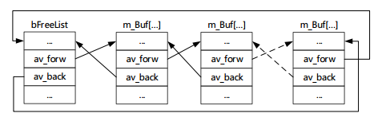

（2）设备队列
每类块设备都有一个设备缓存队列，其队首、队尾分别由相应块设备表中
的 b_forw 和 b_back 指示。队列中各缓存控制块用指针 b_forw、 b_back 双向
勾连（图 6.23）。一个缓存被分配用于读、写某类块设备上的某一个字符块时，
其相应缓存就进入该类块设备缓存队列中，除非将其再分配移作他用，否则它
一直停留在该队列中。 

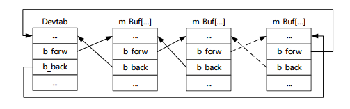

（3）缓存管理算法

系统内有限的缓存要被所有进程共享使用，为了提高其使用效率，选择适
当的缓存管理算法是非常重要的。 缓存管理算法与页式虚拟内存中的管理算
法非常类似，它们的关键问题都是淘汰算法，也就是选择哪一个缓存重新分配
使用。 UNIX V6++采用的缓存淘汰算法是极为精确的 LRU 算法。 因为缓存管
理采用的数据结构以及管理对象与页式虚拟内存不同，所以这种算法的具体
实施过程也不同。下面对此做以说明。
一个缓存刚被分配用于读、写某块设备上某字符块时，相应缓存控制块的
b_flags 中的 B_BUSY 标志被设置，它一定位于相应的设备缓存队列中，而不
在自由队列中 

#### 4.3.2. 打开文件

打开文件基本上和V6++一样的算法。

一个文件可以被同一进程或不同进程，用同一或不同路径名，相同或互异
的操作要求（读、写） 同时打开。而 Inode 基本上包含的是文件的物理结构、
在目录结构中的勾连情况、对各类用户规定的存取权等静态信息，不能容纳这
些个别的在打开文件结构中应该加以反映的动态要求。为此内核设置打开文
件控制块 File，以便记录进程打开文件的读、写请求类型，文件读写位置等动
态信息。
其中， f_flag 包含了对打开文件请求类型，包括读、写以及管道类型，使
用枚举类型 FileFlags 定义。进程打开一个文件时，对其提出的读、写请求应
该在该进程所属用户对这一文件的存取权范围内，只许缩小，不能扩大。用户
正确使用这种要求，可以对文件实施进一步的保护。 

在 UNIX V6++中，我们使用 OpenFiles 类管理每个进程的打开文件。
其中， OpenFiles.ProcessOpenFileTable[]数组可看做一张进程打开文件表，
它本质上是一个 File 对象的指针数组，其中每一项都是一个指针，指向一个
打开文件控制块 File 对象。 NOFILE 定义为 15， 所以每个进程最多可同时打
开 15 个文件。 

#### 4.3.3. 读写文件

- 将content缓冲区的内容写入内部文件fd中length字节。

```CPP
int VFS::write(int fd, u_int8_t *content, int length)
{
    //分析：length可能大于、小于、等于盘块的整数倍
    int writeByteCount = 0;

    User &u = VirtualProcess::Instance()->getUser();
    File *p_file = u.u_ofiles.GetF(fd);
    Inode *p_inode = inodeCache->getInodeByID(p_file->f_inode_id);
    p_inode->i_flag |= Inode::IUPD;

    Buf *pBuf;
    while (writeByteCount < length) 
    {
        BlkNum logicBlkno = p_file->f_offset / DISK_BLOCK_SIZE; //逻辑盘块号
        if (logicBlkno == 1030)
        {
            printf("暂时停下");
        }
        BlkNum phyBlkno = p_inode->Bmap(logicBlkno);            //物理盘块号
        int offsetInBlock = p_file->f_offset % DISK_BLOCK_SIZE; //块内偏移
        //NOTE:可能要先读后写！！！
        //当写不满一个盘块的时候，就要先读后写
        if (offsetInBlock == 0 && length - writeByteCount >= DISK_BLOCK_SIZE)
        {

            //这种情况不需要先读后写
            pBuf = Kernel::instance()->getBufferCache().GetBlk(phyBlkno);
        }
        else
        {
            //先读后写
            pBuf = Kernel::instance()->getBufferCache().Bread(phyBlkno);
        }

        u_int8_t *p_buf_byte = (u_int8_t *)pBuf->b_addr;
        p_buf_byte += offsetInBlock;
        if (length - writeByteCount <= DISK_BLOCK_SIZE - offsetInBlock + 1)
        { //要读大小<=当前盘块剩下的,读需要的大小

            memcpy(p_buf_byte, content, length - writeByteCount);
            p_file->f_offset += length - writeByteCount;
            writeByteCount = length;
            //修改offset
        }
        else
        { //把剩下的全部读出来
            memcpy(p_buf_byte, content, DISK_BLOCK_SIZE - offsetInBlock + 1);
            p_file->f_offset += DISK_BLOCK_SIZE - offsetInBlock + 1;
            writeByteCount += DISK_BLOCK_SIZE - offsetInBlock + 1;

            //修改offset
        }
        Kernel::instance()->getBufferCache().Bdwrite(pBuf);
    }

    return writeByteCount;
}
```


- 从内部文件fd中读出length字节放到content缓冲区中。

返回读出的字节数，如果fd剩下的字节小于length，则只把剩下的读出

```CPP
int VFS::read(int fd, u_int8_t *content, int length)
{
    //分析：length可能大于、小于、等于盘块的整数倍
    int readByteCount = 0;

    User &u = VirtualProcess::Instance()->getUser();
    File *p_file = u.u_ofiles.GetF(fd);
    Inode *p_inode = inodeCache->getInodeByID(p_file->f_inode_id);
    p_inode->i_flag |= Inode::IUPD;
    Buf *pBuf;

    if (length > p_inode->i_size - p_file->f_offset + 1)
    {
        length = p_inode->i_size - p_file->f_offset + 1;
    }

    while (readByteCount < length && p_file->f_offset <= p_inode->i_size) //NOTE 这里是<还是<=再考虑一下
    {
        BlkNum logicBlkno = p_file->f_offset / DISK_BLOCK_SIZE; //逻辑盘块号
        BlkNum phyBlkno = p_inode->Bmap(logicBlkno);            //物理盘块号
        int offsetInBlock = p_file->f_offset % DISK_BLOCK_SIZE; //块内偏移
        pBuf = Kernel::instance()->getBufferCache().Bread(phyBlkno);
        u_int8_t *p_buf_byte = (u_int8_t *)pBuf->b_addr;
        p_buf_byte += offsetInBlock;
        if (length - readByteCount <= DISK_BLOCK_SIZE - offsetInBlock + 1)
        { //要读大小<=当前盘块剩下的,读需要的大小

            memcpy(content, p_buf_byte, length - readByteCount);
            p_file->f_offset += length - readByteCount;
            readByteCount = length;
            content += length - readByteCount;
            //修改offset
        }
        else
        { //把剩下的全部读出来
            memcpy(content, p_buf_byte, DISK_BLOCK_SIZE - offsetInBlock + 1);
            p_file->f_offset += DISK_BLOCK_SIZE - offsetInBlock + 1;
            readByteCount += DISK_BLOCK_SIZE - offsetInBlock + 1;
            content += DISK_BLOCK_SIZE - offsetInBlock + 1;
            //修改offset
        }
        Kernel::instance()->getBufferCache().Brelse(pBuf);
    }

    return readByteCount;
}

```

### 4.4. 工程中遇到的一些问题

1. **fread**

```
fread返回的不是字节数，

当且仅当下面这么用的时候，返回值才是字节数（当然因为恰好一个数据块大小为1个字节，相当于realRead*1）

 

char buff[size];
FILE *fp;
...
realRead = fread(buff, 1, size, fp);
...

如果是: fread(buff, size, 1, fp)
返回1表示读取了size字节，返回0表示读取数量不够size字节

```

2. **==和&的运算优先级**

```
if ((p_delete_inode->i_mode & Inode::IFMT) == Inode::IFDIR) //目录文件

```

要打括号，因为==的优先级大于&

3. **LRU缓存的一个bug**

```cpp
void BufferCache::Bflush()
{
    Buf *bp;

    for (bp = this->bFreeList.av_forw; bp != &(this->bFreeList); bp = bp->av_forw)
    {
        /* 找出自由队列中所有延迟写的块 */
        if ((bp->b_flags & Buf::B_DELWRI))
        {
            //bwrite方法会清除B_DELWRI标志的
            this->NotAvail(bp);
            this->Bwrite(bp);
            this->Brelse(bp);
            std::cout<<bp->b_blkno<<std::endl;
        }
    }

    return;
}

```

for中的`bp = bp->av_forw`是有问题的，因为当前`this->NotAvail(bp);`、`this->Bwrite(bp);`、` this->Brelse(bp);`已将把bp对应的盘块在自由缓存队列中的位置变了。

正确的改成下面：

```cpp
void BufferCache::Bflush()
{
    Buf *bp;

    for (bp = this->bFreeList.av_forw; bp != &(this->bFreeList); bp = bp->av_forw)
    {
        /* 找出自由队列中所有延迟写的块 */
        if ((bp->b_flags & Buf::B_DELWRI))
        {
            //bwrite方法会清除B_DELWRI标志的
            //this->NotAvail(bp);
            this->Bwrite(bp);
            //this->Brelse(bp);
            std::cout << bp->b_blkno << std::endl;
        }
    }
    return;
}

```


## 5. 测试

### 5.1. 编译生成可执行文件

使用make命令编译

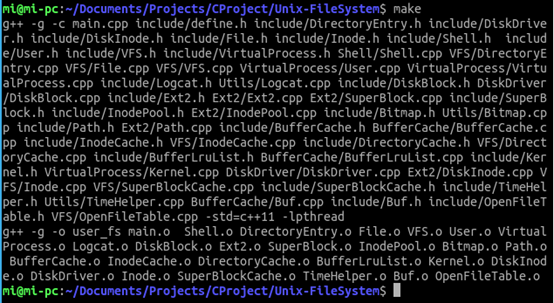

清理编译中间文件


编译出的可执行文件user_fs

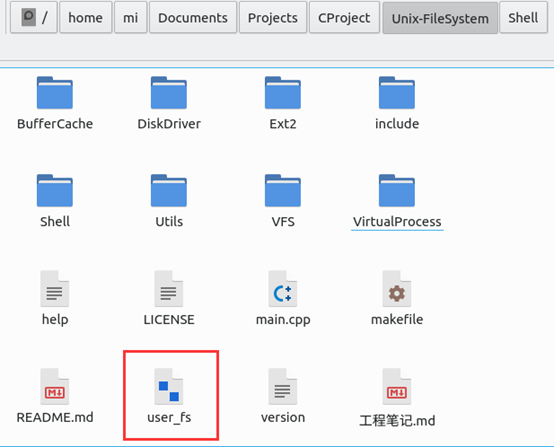

在termital中输入`./user_fs`执行user_fs


### 5.2. 帮助及版本信息查看

输入

```shell
help

```

查看使用说明

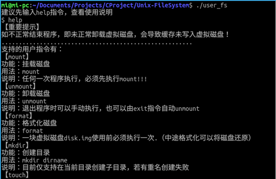

输入

```shell
version

```

查看版本信息

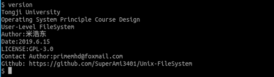


### 5.3. 挂载及格式化

输入

```shell
mount

```

挂载磁盘

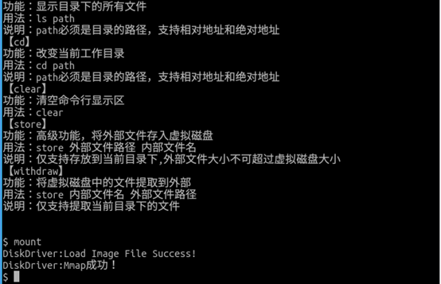

如果之前没有虚拟磁盘，会生成一个虚拟磁盘文件`disk.img` 

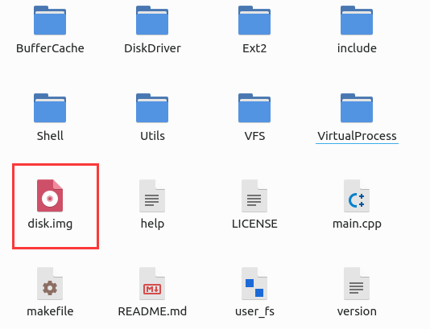

因为是新磁盘，需要输入下面的命令进行格式化

```shell
format

```

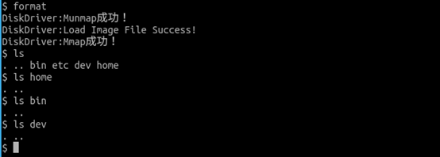

format之后的磁盘，是Ext2文件卷的格式。并且已经建立了根目录、bin、etc、dev、home目录。

### 5.4. cd和ls功能

准备目录结构

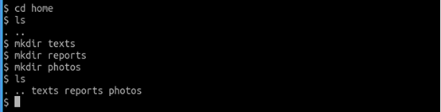

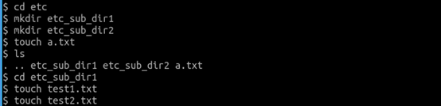

为了实验，我们先建立测试用的目录树：

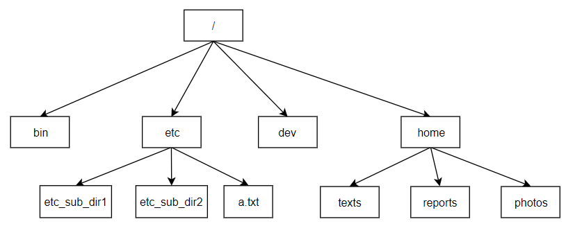


测试cd命令，支持相对地址和绝对地址 

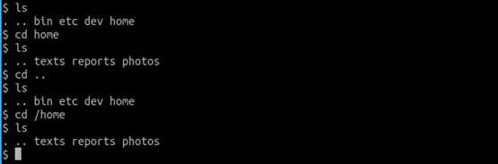

测试ls命令，支持相对地址和绝对地址 


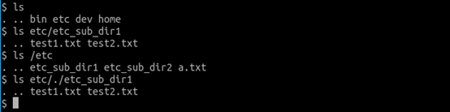

### 5.5. 创建/删除文件或目录

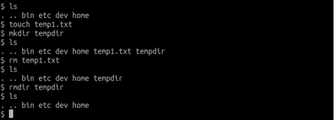

### 5.6. 写入写出文件

在外部准备好一个文件，这里以一张图片为例

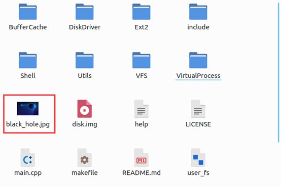

通过store命令，将图片存入虚拟磁盘

```shell
store black_hole.jpg inner_black_hole.jpg

```

用ls指令查看，可以发现成功存入

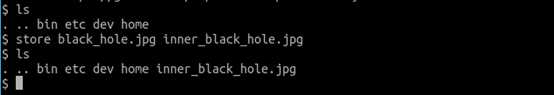

为了验证写入写出是不是完好的，我们用withdraw命令，将虚拟磁盘中的文件再写出。

```shell
withdraw inner_black_hole.jpg black_hole_withdraw.jpg

```

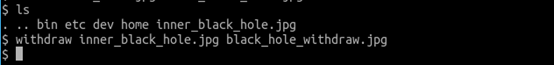

用文件资源管理器查看可以发现，从虚拟磁盘中读出的文件（下图中红色框）和原本写入虚拟磁盘的文件（下图中绿色框），完全一样。

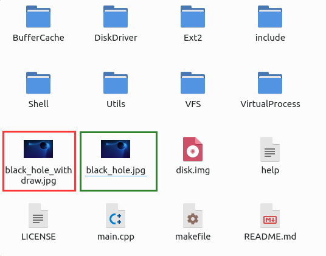

### 5.7. 磁盘卸载

输入指令

```shell
exit

```

可以退出程序，会自动卸载虚拟磁盘。

下图中的一系列数字表示卸载的时候从虚拟磁盘缓存中刷回虚拟磁盘。

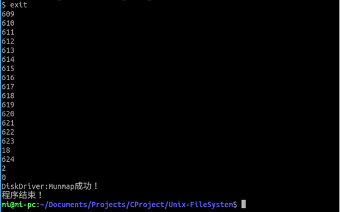

重新加载磁盘，看看是不是持久化了。这回由于使用的之前的磁盘，不需要格式化，直接mount即可，然后ls命令查看目录中的文件，发现刚才写入虚拟磁盘的文件还在，持久化成功。

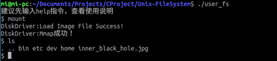


## 6. 本项目在线链接

课程设计-用户级文件系统
[https://github.com/SuperAmi3401/Unix-FileSystem](https://github.com/SuperAmi3401/Unix-FileSystem)

## 7. 参考资料

1. [IBM-Linux文件系统](https://www.ibm.com/developerworks/cn/linux/l-linux-filesystem/index.html)
2. [The Linux Kernel](http://www.tldp.org/LDP/tlk/tlk.html)
3. [Introduction about VFS](https://segmentfault.com/a/1190000008476809)